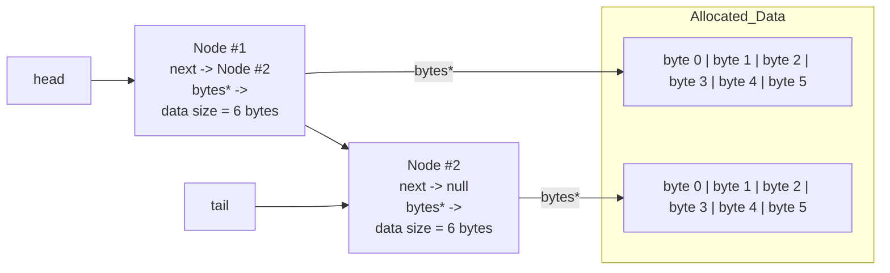

# Project-1: Remote GitHub Development and Performance Monitoring
CS 351 – Computer Architecture

Zainab Ghafoor

This project introduces remote GitHub-based development while exploring how different memory allocation strategies in C++ affect program performance. By building, benchmarking, and analyzing multiple implementations of the same algorithm, the project compares stack, heap, and container-based memory usage and evaluates their impact on runtime, scalability, and system-level behavior such as heap expansion and stack limits.

---

# Memory Allocation Performance Report

## 1. Which program is fastest? Is it always the fastest?

Across all tests, **`alloca.out`** was consistently the fastest for small and medium workloads.  
It averaged about **0.021s at 100k blocks** and **0.195s at 1M blocks**, edging out `malloc.out`.  
However, when the data per node was large (2–4 KB), all four programs performed almost the same.  
So `alloca.out` is generally the fastest, but not always, because the advantage fades as node size increases.

---

## 2. Which program is slowest? Is it always the slowest?

`list.out` and `new.out` were the slower pair in every test, though which one was actually last varied slightly.  
`new.out` tended to be slowest for small lists, while `list.out` often took the longest on larger lists.  
When node sizes became large, all four implementations converged in runtime, so **no clear slowest** remained.

---

## 3. Was there a trend in program execution time based on the size of data in each Node? If so, what, and why?

Yes, as the data per node increased from small (10 bytes) to large (kilobytes), the **total runtime increased** for all programs.  
At the same time, the difference between implementations shrank.  

With small nodes, allocator choice made a big difference;  
with large nodes, **hashing and memory bandwidth dominated**.

---

## 4. Was there a trend in program execution time based on the length of the block chain?

Yes, increasing `NUM_BLOCKS` from **10k → 100k → 1M** led to **nearly linear growth** in runtime.  
Programs with heavier per-node management (`list.out`, `new.out`) scaled worse.  

`alloca.out` and `malloc.out` scaled best, staying consistently faster as the chain grew longer.

---

## 5. Consider heap breaks, what's noticeable? Does increasing the stack size affect the heap? Speculate on any similarities and differences in programs?

`alloca.out` showed the same small number of breaks (69) regardless of list length.  
This is proof that it uses the **stack**.  

The heap-based programs (`malloc`, `new`, `list`) all showed rising break counts as `NUM_BLOCKS` increased,  
since they had to **expand the heap** to satisfy new allocations.  

Changing the stack limit (`ulimit -s unlimited`) had **no effect** on heap activity,  
because the **stack and heap are separate memory regions**.

---

## 6. Considering either the malloc.cpp or alloca.cpp versions of the program, generate a diagram showing two Nodes. 
In 'alloca.cpp' the nodes live on the stack as placement new; in 'malloc.cpp'/'new.cpp', they live on the heap.

## 7. There's an overhead to allocating memory, initializing it, and eventually processing (in our case, hashing it). For each program, were any of these tasks the same? Which one(s) were different?

The difference is the **memory acquisition method**, such as:

- `std::list` allocator  
- `new`  
- `malloc + placement`  
- `alloca + placement`

and how each implementation maintains its linked list.
  
---

## 8. As the size of data in a Node increases, does the significance of allocating the node increase or decrease?

It becomes **less**.  
When nodes are tiny, the cost of frequent allocations dominates runtime differences.  
As each node holds more data, the **hashing and copying work outweighs allocation overhead**,  
so performance differences between allocation methods largely disappear.

