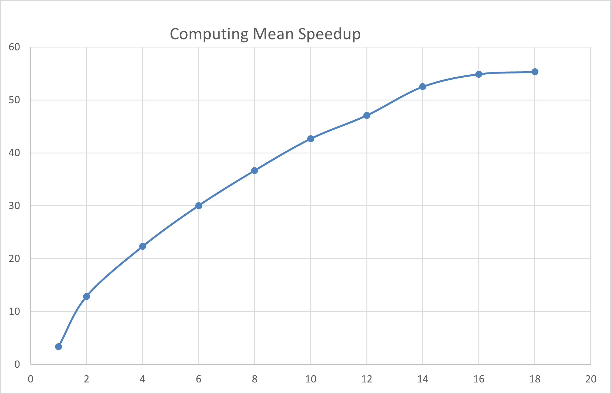
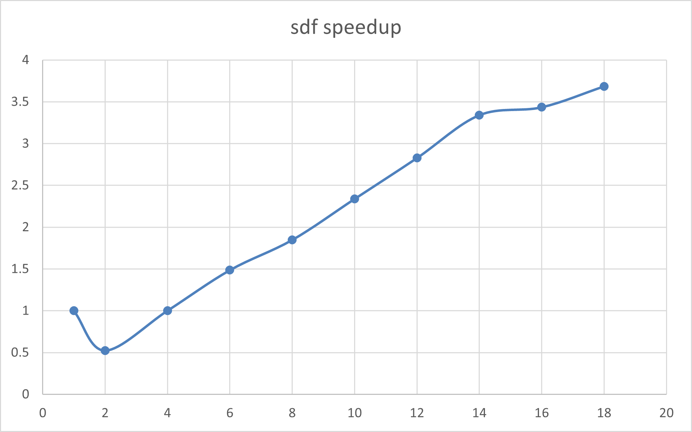

# Project-2: Threading and Multi-core Applications

This project implements multi-threaded versions of two programs (**mean.cpp** and **sdf.cpp**) to explore parallel computation and performance scaling on multi-core CPUs. It includes timing analysis, speedup graphs, bandwidth calculations, and an Amdahl’s Law evaluation.

---

## Computing a Mean

### Speedup Graph

---

### 1. Does the speedup curve converge?

Yes, the speedup curve converges. The curve rises up to about 14–16 threads, then begins to flatten around **55×** speedup. This flattening indicates the serial portion of the program is becoming the bottleneck. After ~16 threads, adding more threads yields almost zero improvement.

---

### 2. Maximum speedup achieved

The maximum speedup observed was **≈55.3× at 18 threads**.

---

### 3. What happens when using more threads than hardware cores?

When the thread count exceeds the number of available physical cores:

- Performance stops improving  
- Speedup may slightly worsen  

This is visible in the graph after 16 threads.

---

### 4. Do we get linear scaling with more cores?

No. The scaling is **sublinear**. From 16 to 18 threads the gain is almost zero, showing diminishing returns.

---

### 5. Amdahl’s Law: Estimate of p

Using the max observed speedup:

Using the max observed speedup:

S = 55
n = 18

Amdahl’s Law:
S = 1 / ((1 - p) + (p / n))

Solving:
1 / 55 = (1 - p) + (p / 18)

1 / 55 = (1 - p) (1 - 1 / 18)

1 / 55 = (1 - p) (17 / 18) 

 p= (1 - 1 / 55) / (17 / 18)

Result:
p ≈ 0.988

Thus:

- About **98.8%** of the program is parallelizable  
- About **1.2%** is irreducibly serial  

Based on graph behavior, a reasonable estimate is **p ≈ 0.98**. I got this by noticing where the graph levels off (around a 50–55× speedup) and interpreting that flattening value as the practical maximum speedup, which implies only about 1–2% of the work is serial.
 

---

### 6. How many bytes of data are processed per iteration?

Each iteration reads a single `float`, so:

- **4 bytes per iteration**

---

### 7. Bandwidth estimation

Total samples:
N = 8,500,000,000

Total bytes:
34 GB = 8.5 × 10^9 × 4 = N x 4

Fastest run time:
1.33 s

Bandwidth:
34 GB / 1.33 s ≈ 25.6 GB/s

---

### 8. Is the bandwidth consistent across threaded versions?

No — bandwidth increases with thread count:

| Version               | Time (s) | Bandwidth |
|----------------------|----------|-----------|
| Serial               | 73.01    | 0.47 GB/s |
| Threaded (1 thread)  | 10.87    | 3.1 GB/s  |
| Threaded (many)      | 1.33     | 25.6 GB/s |

Bandwidth plateaus around **16+ threads**, matching the speedup flattening.

---

## Computing a Volume (SDF)

### Speedup Graph

---

### 9. Do you get a similar performance curve to threaded.out?

**Yes**, with some differences.

**Similarities:**
- Speedup rises quickly as thread count increases.
- Curve flattens once physical cores are saturated.
- Diminishing returns appear, as predicted by Amdahl’s Law.

**Differences:**
- Maximum speedup is lower.
- `sdf.cpp` is **compute-bound**, not memory-bound.
- It performs:
  - Random number generation  
  - Signed-distance calculations  
These operations limit parallel scaling compared to the bandwidth-bound mean computation.

---

