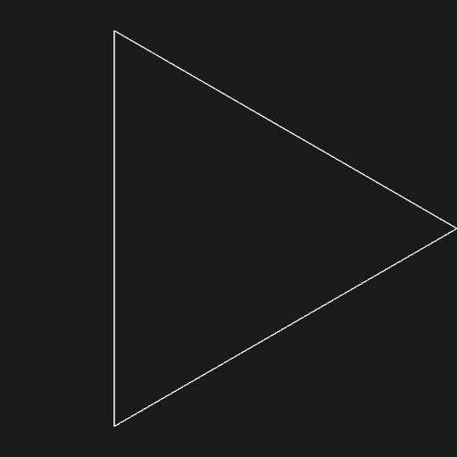
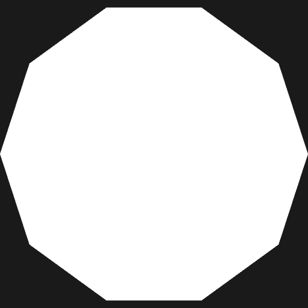
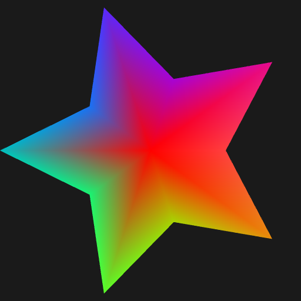

# Project 3 – WebGL Procedural Geometry  
CS 351 – Computer Architecture
Zainab Ghafoor

This project explores procedural geometry in WebGL by generating shapes entirely inside the vertex shader using `gl_VertexID`. Each version builds on the previous one.

---

## Table of Contents 

1. **[Wireframe Triangle](triangle.html)**
2. **[10-Sided Filled Polygon](disk.html)**
3. **[Five-Pointed Colored Star](start.html)**
4. **[Five-Pointed Rotating Colored Star](start-commented.html)**

---

## Image Previews 

  
  
  

---

## Descriptions

### 1. Wireframe Triangle (`triangle.html`)
Creates an equilateral triangle procedurally using `gl_VertexID` and draws it in wireframe using `gl.LINE_LOOP`. No buffers or external geometry are used.

### 2. 10-Sided Filled Polygon (`disk.html`)
Extends the triangle version by switching to `gl.TRIANGLE_FAN` and using a uniform `N` to compute a 10-sided convex polygon. Vertex 0 is the shared center.

### 3. Five-Pointed Colored Star (`start.html`)
Modifies vertex positions by alternating the radius based on even and odd `gl_VertexID` values. This produces the shape of a five-pointed star.

### 4. Five-Pointed Rotating Colored Star (`start-commented.html`)
Adds a time uniform to rotate the star each frame. Colors are generated procedurally using interpolated values based on vertex angle, creating a smooth rainbow effect.
