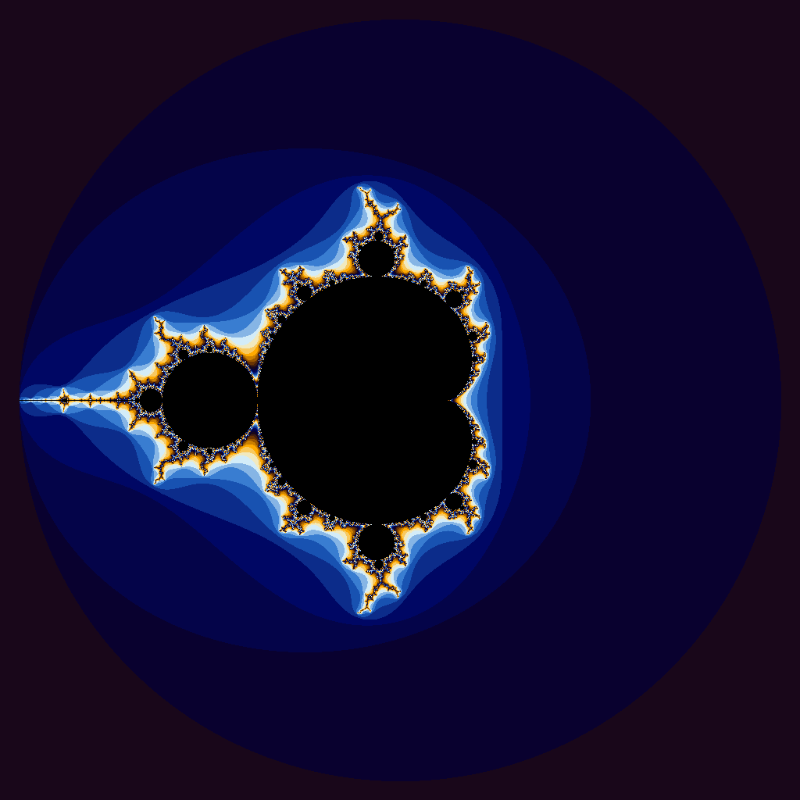

# Project 4: CUDA Iota & Fractal Generator
CS 351 – Computer Architecture

Zainab Ghafoor

This project explores basic GPU programming with NVIDIA CUDA.  
It consists of two independent parts:

1. **A CUDA-accelerated version of the `std::iota` function**  
2. **A CUDA-implementation of a Julia/Mandelbrot fractal image generator**

Both programs were compiled and executed on the Oblivus cloud GPU server using an NVIDIA RTX A6000.

---
# Part 1: CUDA Iota Function

The first part of this project involved writing two versions of the `iota` function:

- **iota.cpu**- the CPU version using a simple `for` loop  
- **iota.gpu**- the CUDA version, where each element is computed by one GPU thread  

I then collected timing results using the `runTrials.sh` script.

---

## Timing Results
` ./runTrials.sh ./iota.cpu`
|Vector Length|Wall Clock Time|User Time|System Time|
|:--:|--:|--:|--:|
|10| 0.00| 0.00| 0.00|
|100| 0.00| 0.00| 0.00|
|1000| 0.00| 0.00| 0.00|
|10000| 0.00| 0.00| 0.00|
|100000| 0.00| 0.00| 0.00|
|1000000| 0.00| 0.00| 0.00|
|5000000| 0.02| 0.00| 0.02|
|100000000| 0.52| 0.08| 0.44|
|500000000| 2.64| 0.43| 2.21|
|1000000000| 5.33| 0.89| 4.44|
|5000000000|35.76| 5.28|30.48|

`./runTrials.sh ./iota.gpu`
|Vector Length|Wall Clock Time|User Time|System Time|
|:--:|--:|--:|--:|
|10| 0.19| 0.03| 0.12|
|100| 0.10| 0.00| 0.09|
|1000| 0.10| 0.01| 0.09|
|10000| 0.10| 0.01| 0.09|
|100000| 0.10| 0.00| 0.08|
|1000000| 0.12| 0.01| 0.10|
|5000000| 0.13| 0.01| 0.11|
|100000000| 0.69| 0.13| 0.55|
|500000000| 3.35| 1.01| 2.33|
|1000000000| 5.89| 1.29| 4.58|
|5000000000|63.24|10.14|53.09|

# Questions

### 1) Are the results what you expected?

Yes, the CPU implementation performed much faster than the CUDA implementation for small and medium vector sizes. Even for large vectors, the GPU was not significantly faster and was often slower.

### 2) Speculate as to why it looks like CUDA isn’t a great solution for this problem.

- CUDA introduces large overhead for memory transfers and kernel launches.  
- The `iota` function is too simple; it performs almost no computation relative to the amount of data being moved.  
- GPUs are only effective when the computational work is heavy enough to amortize memory transfer costs, which is not the case here.  
- CPUs are extremely fast at sequential memory writes.

**CUDA provides no benefit here because the kernel does very little work, and the overhead dominates the runtime.**

---

# Part 2: Julia/Mandelbrot Image

Below is the fractal image generated by my CUDA implementation.  
This image corresponds to the **Mandelbrot set**, generated by iterating `z = z*z + c` with the initial value `z₀ = (0.0, 0.0)`.

This produces the classic Mandelbrot set shape because each pixel computes how many iterations it takes for the value of `z` to escape (its magnitude exceeds 2). The color at each pixel is determined by how many iterations were required.

*Figure 1: Mandelbrot set generated using a CUDA-accelerated escape-time algorithm.*

